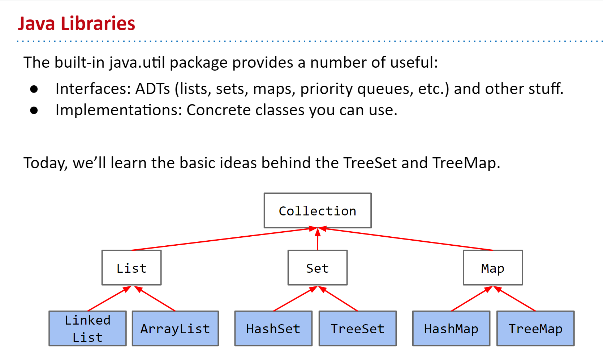
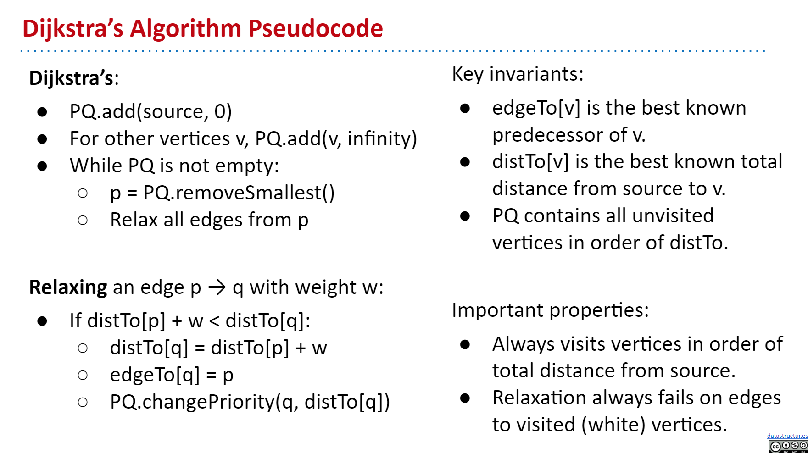

<h2> CS 61B FALL 2020 </h2>

- [1. Intro Hello World Java](#1-intro-hello-world-java)
- [2. Defineing and Using Classes](#2-defineing-and-using-classes)
- [3. References, Recursion, and Lists](#3-references-recursion-and-lists)
- [4. SLLists, Nested Classes, Sentinel Nodes](#4-sllists-nested-classes-sentinel-nodes)
- [5. DLLists, Arrays](#5-dllists-arrays)
- [6. ALists, Resizing, vs. SLists](#6-alists-resizing-vs-slists)
- [7. Testing](#7-testing)
- [8. Inheritance, Implements](#8-inheritance-implements)
- [9. Extends, Casting, Higher Order Functions](#9-extends-casting-higher-order-functions)
- [10. Subtype Polymorphism vs. HoFs](#10-subtype-polymorphism-vs-hofs)
- [11. Exceptions, Iterators, Object Methods](#11-exceptions-iterators-object-methods)
- [12. Coding in the Real World, Review](#12-coding-in-the-real-world-review)
- [13. Asymptotics I](#13-asymptotics-i)
- [14. Disjoint Sets](#14-disjoint-sets)
- [15. Asymptotics II](#15-asymptotics-ii)
- [16. ADTs, Sets, Maps, BSTs](#16-adts-sets-maps-bsts)
- [19. Range Searching and Multi-Dimensional Data](#19-range-searching-and-multi-dimensional-data)
- [20. Hashing](#20-hashing)
- [21. Heaps and PQs](#21-heaps-and-pqs)
- [22. Prefix Operations and Tries](#22-prefix-operations-and-tries)
- [23. Tree and Graph Traversals](#23-tree-and-graph-traversals)
- [24. Graph Traversals and Implementations](#24-graph-traversals-and-implementations)
- [25. Shortest Paths](#25-shortest-paths)
- [26. Minimum Spanning Trees](#26-minimum-spanning-trees)
- [27. Software Engineering I](#27-software-engineering-i)
- [28. Reductions and Decomposition](#28-reductions-and-decomposition)
- [29. Basic Sorts](#29-basic-sorts)
- [30. Quick Sort](#30-quick-sort)
- [31. Software Engineering II](#31-software-engineering-ii)
  
#### 1. Intro Hello World Java

#### 2. Defineing and Using Classes

- Static v.s. Non-static
  - Static methods are invoked using the class name, e.g. `Dog.makeNoise()`;
  - Instance methods are invoked using an instance name, e.g. `maya.makeNoise()`;
  - Static methods can’t access “my” instance variables, because there is no “me”.
  - Some classes are never instantiated. For example, `Math`.
  - A variable or method defined in a class is also called a member of that class. 
  - Static members are accessed using class name, e.g. `Dog.binomen`.
  - Non-static members cannot be invoked using class name: ~~`Dog.makeNoise()`~~
  - Static methods must access instance variables via a specific instance, e.g. `d1`. 
- public static void main(String[] args)
  - Command Line Arguments
  - Convert string to integer: `Integer.parseInt(args[0])`
- Using Libraries
  - The built-in Java libraries (e.g. `Math`, `String`, `Integer`, `List`, `Map`)
  - The Princeton standard library (e.g. `StdDraw`, `StdAudio`, `In`)

#### 3. References, Recursion, and Lists

- Primitive Types
  - 8 primitive types in Java: `byte`, `short`, `int`, `long`, `float`, `double`, `boolean`, `char`
  - when declaring a variable of a certain type
    - Your computer sets aside exactly enough bits to hold a thing of that type.
    - Java creates an internal table that maps each variable name to a location.
    - Java does NOT write anything into the reserved boxes.
      - For safety, Java will not let access a variable that is uninitialized.
  - The Golden Rule of Equals (GRoE)
      - Given variables $y$ and $x$: $y = x$ copies all the bits from $x$ into $y$.
- Reference Types
  - Everything else, including arrays, is a reference type.
  - Class Instantiations
    - When we instantiate an Object (e.g. Dog, Walrus, Planet):
      - Java first allocates a box of bits for each instance variable of the class and fills them with a default value (e.g. 0, null).
      - The constructor then usually fills every such box with some other value.
    - Can think of new as returning the address of the newly created object.
      - Addresses in Java are 64 bits.
      - Example (rough picture): If object is created in memory location 2384723423, then new returns 2384723423.
  - Reference Type Variable Declarations
    - When we declare a variable of any reference type (Walrus, Dog, Planet):
      - Java allocates exactly a box of size 64 bits, no matter what type of object.
      - These bits can be either set to:
        - Null (all zeros).
        - The 64 bit “address” of a specific instance of that class (returned by new).
    - The 64 bit addresses are meaningless to us as humans, so we’ll represent:
      - All zero addresses with “null”.
      - Non-zero addresses as arrows.
      - This is sometimes called “box and pointer” notation.
  - Reference Types Obey the Golden Rule of Equals
    - In terms of our visual metaphor, we “copy” the arrow by making the arrow in the b box point at the same instance as a.
- Parameter Passing
  - Passing parameters obeys the same rule: Simply **copy the bits** to the new scope.
- Instantiation of Arrays
  - Declaration creates a 64 bit box intended only for storing a reference to an int array. **No object is instantiated**. (declaration)
  - Instantiates a new Object, in this case an int array. Object is anonymous! (instantiation)
  - Puts the address of this new Object into the 64 bit box named a. (assignment)
- IntList and Linked Data Structures
- Old Deprecated Slides
  - Java is “Pass by Value”
    - The exact contents of the container in the outside world are delivered to the containers in the function. If the container has an arrow, so be it.
  - If a class doesn’t define equals, and you call equals, what happens?
    - It defaults to the implementation of equals in the “object” class (more on this later), but it uses `==`!

#### 4. SLLists, Nested Classes, Sentinel Nodes

- From IntList to SLList
- Public vs. Private Nested Classes
  - Use the `private` keyword to prevent code in other classes from using members (or constructors) of a class.
  - Nothing to do with protection against hackers, spies, and other evil entities.
  - Why Nested Classes?    
    - Nested Classes are useful when a class doesn’t stand on its own and is obviously subordinate to another class.
    - In my opinion, probably makes sense to make `IntNode` a nested private class.
  - Static Nested Classes
    - Static classes cannot access outer class’s instance variables or methods.
    - Results in a minor savings of memory.
    - Analogy: Static methods had no way to access “my” instance variables. Static classes cannot access “my” outer class’s instance variables. 
    - Unimportant note: For private nested classes, access modifiers are irrelevant.
- addLast() and size()
- Sentinel Nodes

#### 5. DLLists, Arrays

- Doubly Linked Lists
- Generic Lists
  - Java allows us to defer type selection until declaration.
- Arrays
  - Unlike classes, arrays do not have methods.
  - Like classes, arrays are (almost always) instantiated with new.
  - Arraycopy: `System.arraycopy(b, 0, x, 3, 2);`
    - Takes 5 parameters: Source array, Start position in source, Target array, Start position in target, Number to copy. 
- 2D Arrays
- Arrays vs. Classes
  - Arrays and Classes can both be used to organize a bunch of memory boxes.
    - Array boxes are accessed using [] notation.
    - Class boxes are accessed using dot notation.
    - Array boxes must all be of the same type.
    - Class boxes may be of different types.
    - Both have a fixed number of boxes.
  - Array indices can be computed at runtime.
  - Class member variable names CANNOT be computed and used at runtime.
  - The only (easy) way to access a member of a class is with hard-coded dot notation.

#### 6. ALists, Resizing, vs. SLists

- A Last Look at Linked Lists
- Naive Array Lists
- Resizing Arrays
  - This is how the Python list is implemented
    ```java
    public void addLast(int x) {
      if (size == items.length) {
      resize(size * RFACTOR);
      }
      items[size] = x;
      size += 1;
    }

    ```
  - Memory Efficiency
    - Define the “usage ratio” R = size / items.length
    - Typical solution: Half array size when R < 0.25.
- Generic ALists
  - When creating an array of references to Glorps:
    - `(Glorp []) new Object[cap]`;
    - Causes a compiler warning, which you should ignore.
  - Why not just `new Glorp[cap]`;
    - Will cause a “generic array creation” error.
  - Nulling Out Deleted Items
    - Java only destroys unwanted objects when the last reference has been lost.
    - Keeping references to unneeded objects is sometimes called loitering.
- Obscurantism in Java


#### 7. Testing

- Some languages support sub-indexing into arrays. Java does not. **No way to get address of the middle of an array.**
- For example: `sort(x[1:]);` ← Would be nice, but not possible!


#### 8. Inheritance, Implements

- Method Overloading in Java
  - Java allows multiple methods with same name, but different parameters.
- Hypernyms, Hyponyms, and Interface Inheritance
- Overriding vs. Overloading
  - If a “subclass” has a method with the exact same signature as in the “superclass”, we say the subclass overrides the method.
  - `@Override Annotation`: The only effect of this tag is that the code won’t compile if it is not actually an overriding method.
  - Why use `@Override`
    - Protects against typos. If you say `@Override`, but it the method isn’t actually overriding anything, you’ll get a compile error.
    - Reminds programmer that method definition came from somewhere higher up in the inheritance hierarchy.
- Interface Inheritance
  - Specifying the capabilities of a subclass using the implements keyword is known as interface inheritance.
    - Interface: The list of all method signatures.
    - Inheritance: The subclass “inherits” the interface from a superclass.
    - Specifies what the subclass can do, but not how.
    - Subclasses must override all of these methods!
    - Will fail to compile otherwise.
  - If X is a superclass of Y, then memory boxes for X may contain Y.
- Implementation Inheritance: Default Methods
  - Interface inheritance:
    - Subclass inherits signatures, but NOT implementation.
  - For better or worse, Java also allows implementation inheritance.
    - Subclasses can inherit signatures AND implementation.
  - Use the **default** keyword to specify a method that subclasses should inherit from an interface.
  - If you don’t like a default method, you can override it.
- Static and Dynamic Type, Dynamic Method Selection
  - Every variable in Java has a “compile-time type”, a.k.a. “static type”.
    - This is the type specified at **declaration**. Never changes!
  - Variables also have a “run-time type”, a.k.a. “dynamic type”.
    - This is the type specified at **instantiation** (e.g. when using new).
    - Equal to the type of the object being pointed at.
  - Suppose we call a method of an object using a variable with: compile-time type X, run-time type Y.
    - Then if Y **overrides** the method, Y’s method is used instead.
    - This is known as “dynamic method selection”.
- More Dynamic Method Selection, Overloading vs. Overriding
- Interface vs. Implementation Inheritance
  - In both cases, we specify “is-a” relationships, not “has-a”.


#### 9. Extends, Casting, Higher Order Functions

- Implementation Inheritance: Extends
  - When a class is a hyponym of an interface, we used **implements**.
  - If you want one class to be a hyponym of another class, you use **extends**.
  - Because of extends, RotatingSLList inherits all members of SLList:
    - All instance and static variables.
    - All methods.
    - All nested classes.
    - Constructors are not inherited.
  - Java syntax disallows `super.super`.
  - Constructors are not inherited. However, the rules of Java say that **all constructors must start with a call to one of the super class’s constructors**. `super()`
  - If you don’t explicitly call the constructor, Java will *automatically* do it for you.
  - If you want to use a super constructor other than the no-argument constructor, can give parameters to super.
  - As it happens, every type in Java is a descendant of the Object class.
  - extends should only be used for **is-a** (hypernymic) relationships!
- Encapsulation
  - **Module**: A set of methods that work together as a whole to perform some task or set of related tasks. 
  - A module is said to be **encapsulated** if its implementation is completely hidden, and it can be accessed only through a documented interface.
  - Java is a great language for enforcing abstraction barriers with syntax.
  - Implementation inheritance (e.g. extends) breaks encapsulation!
- Type Checking and Casting
  - Method calls have compile-time type equal to their declared type.
  - Casting is a powerful but dangerous tool.
    - Tells Java to treat an expression as having a different compile-time type.
    - In example below, effectively tells the compiler to ignore its type checking duties.
    - Does not actually change anything: sunglasses don’t make the world dark.
- Dynamic Method Selection and Casting Puzzle
  - Casting causes no change to the bird variable, nor to the object the bird variable points at!
  - The compiler chooses the most specific matching method signature from **the static type of the invoking class**.
  - Since there is no **overriding**, no dynamic method selection occurs.
- Higher Order Functions (A First Look)
  - Higher Order Function: A function that treats another function as data. e.g. takes a function as input.
  - Old School (Java 7 and earlier). Fundamental issue: Memory boxes (variables) cannot contain pointers to functions.
  - In Java 8, new types were introduced: now can can hold references to methods.
- **Implementation Inheritance Cheatsheet**
  - VengefulSLList extends SLList means a VenglefulSLList is-an SLList. Inherits all members!
    - Variables, methods, nested classes.
    - Not constructors.
    - Subclass constructor must invoke superclass constructor first.
    - Use super to invoke overridden superclass methods and constructors.
  - Invocation of overridden methods follows two simple rules:
    - Compiler plays it safe and only lets us do things allowed by **static** type.
    - For overridden methods the actual method invoked is based on **dynamic** type <span style="color: red">(Does not apply to overloaded methods!)</span> of invoking expression, `e.g. Dog.maxDog(d1, d2).bark()`;
    - Can use **casting** to overrule compiler type checking.

#### 10. Subtype Polymorphism vs. HoFs

- Dynamic Method Selection Puzzle
  - What if subclass has a static method with the same signature as a superclass method?
    - For static methods, we do not use the term overriding for this.
    - These two practices above are called “hiding”.
    - As promised, the version of the hidden static method that gets invoked is the one in the superclass, and the version of the overridden instance method that gets invoked is the one in the subclass.
- Subtype Polymorphism
- Comparables
  - Advantages
    - Lots of built in classes implement Comparable (e.g. String).
    - Lots of libraries use the Comparable interface (e.g. Arrays.sort)
    - Avoids need for casts.
    ```java
    public class Dog implements Comparable<Dog> {
      public int compareTo(Dog uddaDog) {
        return this.size - uddaDog.size;
      }
    }

    Dog[] dogs = new Dog[]{d1, d2, d3};
    Dog largest = Collections.max(Arrays.asList(dogs));
    ```
- Comparators
  ```java
  public class Dog implements Comparable<Dog> {
    private String name;
    private int size;
  
    public static class NameComparator implements Comparator<Dog> {
      public int compare(Dog d1, Dog d2) {
          return d1.name.compareTo(d2.name);
      }
    }
    ...
  }

  Comparator<Dog> cd = new Dog.NameComparator();
  if (cd.compare(d1, d3) > 0) {
      d1.bark();
  } else {
      d3.bark();
  }
  ```
- Comparable and Comparator Summary
  - Interfaces provide us with the ability to make **callbacks**:
    - Sometimes a function needs the help of another function that might not have been written yet.
      - Example: max needs compareTo
      - The helping function is sometimes called a “callback”.
  - Some languages handle this using explicit function passing.
  - In Java, we do this by wrapping up the needed function in an interface (e.g. `Arrays.sort` needs `compare` which lives inside the `comparator` interface)
  - `Arrays.sort` “calls back” whenever it needs a comparison.
    - Similar to giving your number to someone if they need information.


#### 11. Exceptions, Iterators, Object Methods

- Lists and Sets in Java
  - We built a list from scratch, but Java provides a built-in `List` interface and several implementations, e.g. `ArrayList`.
  - Demo code
    ```java
    // ArrayList
    import java.util.List;
    import java.util.ArrayList;
    
    public class SimpleBuiltInListExample {
      public static void main(String[] args) {
        List<Integer> L = new ArrayList<>();
        L.add(5);
        L.add(10);
        L.add(15);
        System.out.println(L);
      }
    }
    // Set
    Set<String> S = new HashSet<>();
    S.add("Tokyo");
    S.add("Beijing");	
    S.add("Lagos");
    S.add("São Paulo");
    System.out.println(S.contains("Tokyo"));
    ```
- Exceptions
- Iteration
  - To support the enhanced for loop:
    - Add an `iterator()` method to your class that returns an `Iterator<T>`.
    - The `Iterator<T>` returned should have a useful `hasNext()` and `next()` method.
    - Add implements `Iterable<T>` to the line defining your class.
- Object Methods:
- Equals and toString()
  - ArraySet toString
    - Adding even a single character to a string creates an entirely new string. It’s because Strings are “immutable”.
    - Intuition: Append operation for a StringBuilder is fast.
  - Equals vs. ==
    - `==` compares the bits. For references, `==` means “referencing the same object.”
    - `.equals` for classes. Requires writing a `.equals` method for your classes.
      - Default implementation of `.equals` uses `==` (probably not what you want).
    - BTW: Use Arrays.equal or Arrays.deepEquals for arrays
      - When comparing arrays in Java, it's recommended to use `Arrays.equals()` for one-dimensional arrays and `Arrays.deepEquals()` for multi-dimensional arrays or arrays with nested elements.
      - `Arrays.deepEquals()` compares the "deep" contents of the arrays, meaning it will recursively compare nested arrays or other non-primitive elements.
    - The code below is pretty close to what a standard equals method looks like.
      ```java
      @Override
      public boolean equals(Object o) {
        if (o == null) { return false; }
        if (this == o) { return true; } // optimization
        if (this.getClass() != o.getClass()) { return false; }
        ArraySet<T> other = (ArraySet<T>) o;
        if (this.size() != other.size()) { return false; }
          for (T item : this) {
            if (!other.contains(item)) {
              return false;
            }
          }
        return true;
      }
      ```

#### 12. Coding in the Real World, Review

- Programming in the Real World

#### 13. Asymptotics I

- Intuitive Runtime Characterizations
- Worst Case Order of Growth
  - **Justification**: When comparing algorithms, we often care only about the worst case [but we will see exceptions in this course]. 
  - Simplifications:
    - Only consider the worst case.
    - Pick a representative operation (a.k.a. the cost model).
    - Ignore lower order terms.
    - Ignore multiplicative constants.
- Simplified Analysis
- Big-Theta
- Big O Notation

#### 14. Disjoint Sets

- Quick Find
- Quick Union
- Weighted Quick Union
  - Track tree size (**number** of elements).
  - New rule: Always link root of **smaller** tree to **larger** tree.
  - We used the number of items in a tree to decide upon the root.
    - Worst case performance for HeightedQuickUnionDS is asymptotically the same! Both are $Θ(\log (N))$.
    - Resulting code is more complicated with no performance gain.
  - Performance Summary
    | Implementation | Constructor | connect | isConnected |
    | --- | --- | --- | --- |
    |ListOfSetsDS | $\Theta(N)$ | $O(N)$ | $O(N)$ |
    |QuickFindDS | $\Theta(N)$ | $\Theta(N)$ | $\Theta(1)$ |
    |QuickUnionDS | $\Theta(N)$ | $O(N)$ | $O(N)$ |
    |WeightedQuickUnionDS | $\Theta(N)$ | $O(\log N)$ | $O(\log N)$ |
- Path Compression 
  - Clever idea: When we do `isConnected(15, 10)`, tie all nodes seen to the root.
  - Path compression results in a union/connected operations that are very very close to amortized constant time (amortized constant means “constant on average”)..
  - A tighter bound: $O(N + M \alpha (N))$, where $\alpha$ is the inverse Ackermann function.
- Summary
  - The ideas that made our implementation efficient:
    - Represent sets as connected components (don’t track individual connections).
  - ListOfSetsDS: Store connected components as a List of Sets (slow, complicated).
  - QuickFindDS: Store connected components as set ids.
  - QuickUnionDS: Store connected components as parent ids.
  - WeightedQuickUnionDS: Also track the size of each set, and use size to decide on new tree root.
  - WeightedQuickUnionWithPathCompressionDS: On calls to connect and isConnected, set parent id to the root for all items seen.
  - Performance
    | Implementation | Runtime |
    | --- | --- |
    |ListOfSetsDS | $O(NM)$ |
    |QuickFindDS | $\Theta(NM)$ |
    |QuickUnionDS | $O(NM)$ |
    |WeightedQuickUnionDS | $O(N+M\log N)$ |
    |WeightedQuickUnionDSWithPathCompression| $O(N+M\alpha (N))$ |

#### 15. Asymptotics II

#### 16. ADTs, Sets, Maps, BSTs

- Abstract Data Types
  - An Abstract Data Type (ADT) is defined only by its operations, not by its implementation.
  - Interfaces in Java aren’t purely abstract as they can contain some implementation details, e.g. `default` methods.
  - Maps also known as associative arrays, associative lists (in Lisp), symbol tables, dictionaries (in Python).
  ```java
    Map<String, Integer> m = new TreeMap<>();
    String[] text = {"sumomo", "mo", "momo", "mo",
                    "momo", "no", "uchi"};
    for (String s : text) {
      int currentCount = m.getOrDefault(s, 0);
      m.put(s, currentCount + 1);
    }
    ```
  - Among the most important interfaces in the java.util library are those that extend the Collection interface  
- Binary Search Trees
- BST Definitions
  - A binary search tree is a rooted binary tree with the BST property.
  - **BST** Property. For every node X in the tree:
    - Every key in the **left** subtree is **less** than X’s key.
    - Every key in the **right** subtree is **greater** than X’s key.
- BST Operations: Search
- BST Operations: Insert
- BST Operations: Delete
  - Deleting from a BST: Deletion with two Children (Hibbard)
- Sets vs. Maps, Summary
  - Java provides Map, Set, List interfaces, along with several implementations.
  - We’ve seen two ways to implement a Set (or Map): ArraySet and using a BST.
    - ArraySet: $Θ(N)$ operations in the worst case.
    - BST: $Θ(\log N)$ operations in the worst case if tree is balanced.
- BST Implementation Tips 
  - When inserting, always set left/right pointers, even if nothing is actually changing.
  - Avoid “arms length base cases”. Don’t check if left or right is null!

#### 17. B-Trees (2-3, 2-3-4 Trees)

- BST Tree Height
  - Height varies dramatically between “bushy” and “spindly” trees.
- Height, Depth, and Performance
  - The **“depth” of a node** is how far it is from the root
  - The **“height” of a tree** is the depth of its deepest leaf
  - The **“average depth”** of a tree is the average depth of a tree’s nodes
  - Nice Property. Random trees have $Θ(\log N)$ average depth and height.
- B-trees / 2-3 trees / 2-3-4 trees
  - Avoiding Imbalance through Overstuffing
    - Avoid new leaves by “overstuffing” the leaf nodes.
    - “Overstuffed tree” always has balanced height, because leaf depths never change. Height is just max(depth).
    - Height is balanced, but we have a new problem: Leaf nodes can get too juicy.
    - Set a limit L on the number of items, say L=3.
    - If any node has more than L items, give an item to parent.
      - Pulling item out of full node splits it into left and right.
    - Perfect Balance
      - If we split the root, every node gets pushed down by exactly one level.
      - If we split a leaf node or internal node, the height doesn’t change.
  - B-trees of order L=3 (like we used today) are also called a 2-3-4 tree or a 2-4 tree. 
    - “2-3-4” refers to the number of children that a node can have, e.g. a 2-3-4 tree node may have 2, 3, or 4 children.
  - B-trees of order L=2 are also called a 2-3 tree.
  - B-Trees are most popular in two specific contexts:
    - Small L (L=2 or L=3):
      - Used as a conceptually simple balanced search tree (as today).
    - L is very large (say thousands).
      - Used in practice for databases and filesystems (i.e. systems with very large records).
- B-Tree Bushiness Invariants
  - All leaves must be the same distance from the source.
  - A non-leaf node with k items must have exactly k+1 children.
  - These invariants guarantee that our trees will be bushy.
- B-Tree Runtime Analysis
  - Height of a B-Tree with Limit L
    - Height: Between $\log_{L+1}(N)$ and $\log_2(N)$
    - Overall height is therefore $Θ(\log N)$
  - Runtime for contains
    - Worst case number of nodes to inspect: $H + 1$
    - Worst case number of items to inspect per node: $L$
    - Overall runtime: $O(HL)$
    - Since $H = Θ(\log N)$, overall runtime is $O(L \log N)$.
    - Since $L$ is a constant, runtime is therefore $O(\log N)$.
  - Runtime for add
- Deletion (optional)

#### 18. Red Black Trees

- BST Structure and Tree Rotation
- Red-Black Trees
  - A BST with left glue links that represents a 2-3 tree is often called a “Left Leaning Red Black Binary Search Tree” or LLRB.
    - LLRBs are normal BSTs! 
    - There is a 1-1 correspondence between an LLRB and an equivalent 2-3 tree.
    - The red is just a convenient fiction. Red links don’t “do” anything special.
  - What is the maximum height of the corresponding LLRB?
    - Total height is **H (black)** + <span style="color: red">H + 1 (red)</span> = 2H + 1.
  - Some handy LLRB properties:
    - No node has two red links [otherwise it’d be analogous to a 4 node, which are disallowed in 2-3 trees].
    - Every path from root to a ~~leaf~~(This should say “a null reference”, not “a leaf”.) has same number of black links [because 2-3 trees have the same number of links to every leaf]. LLRBs are therefore balanced.
- Maintaining 1-1 Correspondence Through Rotations 
  - #Task1: Insertion Color: Use red! In 2-3 trees new values are ALWAYS added to a leaf node (at first).
  - #Task2: Insertion on the Right: Right links aren’t allowed, so rotateLeft(E).
  - New Rule: Representation of Temporary 4-Nodes. **Temporarily violates “no red right links”.**
  - #Task3: Double Insertion on the Left: Rotate Z right.
  - #Task4: Splitting Temporary 4-Nodes: Flip the colors of all edges touching B.
    - Note: This doesn’t change the BST structure/shape.
  - Summary:
    - When inserting: Use a red link.
    - If there is a right leaning “3-node”, we have a Left Leaning Violation.
      - <u>Rotate left</u> the appropriate node to fix.
    - If there are two consecutive left links, we have an Incorrect 4 Node Violation.
      - <u>Rotate right</u> the appropriate node to fix.
    - If there are any nodes with two red children, we have a Temporary 4 Node.
      - <u>Color flip</u> the node to emulate the split operation.
      - We have a right leaning 3-node (B-S). We can fix with <u>rotateLeft</u>.
    - One last detail: Cascading operations.
      - It is possible that a rotation or flip operation will cause an additional violation that needs fixing. 
      - We have a right leaning 3-node (B-S). We can fix with rotateLeft(b).
- LLRB Runtime and Implementation
  - Amazingly, turning a BST into an LLRB requires only 3 clever lines of code.
  ```java
  private Node put(Node h, Key key, Value val) {
    if (h == null) { return new Node(key, val, RED); }
  
    int cmp = key.compareTo(h.key);
    if (cmp < 0)      { h.left  = put(h.left,  key, val); }
    else if (cmp > 0) { h.right = put(h.right, key, val); }
    else              { h.val   = val;                    }
  
    if (isRed(h.right) && !isRed(h.left))      { h = rotateLeft(h);  }
    if (isRed(h.left)  &&  isRed(h.left.left)) { h = rotateRight(h); }
    if (isRed(h.left)  &&  isRed(h.right))     { flipColors(h);      } 
  
    return h;
  }
  ```
- Search Tree Summary

#### 19. Range Searching and Multi-Dimensional Data

- Range-Finding and Nearest
  - It turns out that a BST can efficiently support the `select`, `rank`, `subSet`, and `nearest` operations.
- Multi-dimensional Data
  - Could just pick one, but you’re losing some of your information about ordering. Results in suboptimal pruning.
- QuadTrees
  - Every Node has **four** children:
    - Top left, a.k.a. northwest.
    - Top right, a.k.a. northeast.
    - Bottom left, a.k.a. southwest.
    - Bottom right, a.k.a. southeast. 
  - Quadtrees are a form of “spatial partitioning”.
    - Space is more finely divided in regions where there are more points.
    - Results in better runtime in many circumstances.
  - Quadtrees allow us to prune when performing a rectangle search.
- Higher Dimensional Data
  - One approach: Use an Oct-tree or Octree.
  - k-d tree example for 2-d:
    - Basic idea, root node partitions entire space into left and right (by x).
    - All depth 1 nodes partition subspace into up and down (by y).
    - All depth 2 nodes partition subspace into left and right (by x).
- Uniform Partitioning
  - All of our approaches today boil down to spatial partitioning.
    - Uniform partitioning (perfect grid of rectangles).
    - Quadtrees and KdTrees: Hierarchical partitioning. 
      - Each node “owns” 4 and 2 subspaces, respectively.
      - Space is more finely divided into subspaces where there are more points.
- Summary and Applications
  - Set operations can be more complex than just contains, e.g.:
    - **Range Finding**: What are all the objects inside this (rectangular) subspace?
    - **Nearest**: What is the closest object to a specific point?
      - Note: Can be generalized to k-nearest.
  - The most common approach is **spatial partitioning**:
    - **Quadtree**: Generalized 2D BST where each node “owns” 4 subspaces.
    - **K-d Tree**: Generalized k-d BST where each node “owns” 2 subspaces.
      - Dimension of ownership cycles with each level of depth in tree.
    - **Uniform Partitioning**: Partition space into uniform chunks.
  - Spatial partitioning allows for **pruning** of the search space.

#### 20. Hashing

- Data Indexed Arrays
- DataIndexedEnglishWordSet
- DataIndexedStringSet
- Integer Overflow and Hash Codes
- Hash Tables: Handling Collisions
  - Each bucket in our array is initially empty. When an item x gets added at index h:
    - If bucket h is empty, we create a new list containing x and store it at index h.
    - If bucket h is already a list, we add x to this list <u>if it is not already present.</u>
- Hash Table Performance
  - One example strategy: When $\frac{N}{M} \geq 1.5$, then double $M$. 
    - Resizing takes $Θ(N)$ time. Have to redistribute all items!
    - Most add operations will be $Θ(1)$. Some will be $Θ(N)$ time (to resize).
      - Similar to our ALists, as long as we resize by a multiplicative factor, the average runtime will still be $Θ(1)$.
      - Note: We will eventually analyze this in more detail.
- Hash Tables in Java
  - Two Important Warnings When Using `HashMaps`/`HashSets`
    - Warning #1: Never store objects that can change in a HashSet or HashMap!
      - If an object’s variables changes, then its hashCode changes. May result in items getting lost.
    - Warning #2: Never override equals without also overriding hashCode.
      - Can also lead to items getting lost and generally weird behavior.
      - HashMaps and HashSets use equals to determine if an item exists in a particular bucket.
  - use `Math.floorMod(x, 4)` to get valid index.
- Good HashCodes (Extra)
  - A typical hash code base is a small prime.
    - Why prime?
      - Never even: Avoids the overflow issue on previous slide.
      - Lower chance of resulting hashCode having a bad relationship with the number of buckets: See study guide problems and hw3.
    - Why small?
      - Lower cost to compute.
- Summary

#### 21. Heaps and PQs

- Heaps
  - Binary min-heap: Binary tree that is complete and obeys min-heap property.
    - Min-heap: Every node is less than or equal to both of its children.
    - Complete: Missing items only at the bottom level (if any), all nodes are as far left as possible.
  - Given a heap, how do we implement PQ operations?
    - `getSmallest()` - return the item in the root node.
    - `add(x)` - place the new employee in the last position, and promote as high as possible.
    - `removeSmallest()` - assassinate the president (of the company), promote the rightmost person in the company to president. Then demote repeatedly, always taking the ‘better’ successor.
- Tree Representations
- Data Structures Summary

#### 22. Prefix Operations and Tries

- Tries
  - Suppose we know that our keys are always strings.
    - Can use a special data structure known as a Trie.
    - Basic idea: Store each letter of the string as a node in a tree.
  - Tries will have great performance on:
    - get
    - add
    - special string operations
- Trie Implementation and Performance
- Alternate Child Tracking Strategies
  - When we implement a Trie, we have to pick a map to our children
    - DataIndexedCharMap: Very fast, but memory hungry.
    - Hash Table: Almost as fast, uses less memory.
    - Balanced BST: A little slower than Hash Table, uses similar amount of memory?
- Trie String Operations
- Autocomplete
  - A More Efficient Autocomplete
    - Each node stores its own value, as well as the value of its best substring.
  - Can also merge nodes that are redundant!
    - This version of trie is known as a “radix tree” or “radix trie”.
- Trie Summary
  - When your key is a string, you can use a Trie:
    - Theoretically better performance than hash table or search tree.
    - Have to decide on a mapping from letter to node. Three natural choices:
      - DataIndexedCharMap, i.e. an array of all possible child links.
      - Bushy BST.
      - Hash Table.
  - All three choices are fine, though hash table is probably the most natural.
  - Supports special string operations like `longestPrefixOf` and `keysWithPrefix`.
    - `keysWithPrefix` is the heart of important technology like autocomplete.
    - Optimal implementation of Autocomplete involves use of a priority queue!

#### 23. Tree and Graph Traversals

- Trees and Traversals
  - Depth First Traversals
    - 3 types: Preorder, Inorder, Postorder
    - Basic (rough) idea: Traverse “deep nodes” (e.g. A) before shallow ones (e.g. F).
    - Traversing a node is different than “visiting” a node. 
  - Preorder: “Visit” a node, then traverse its children
  - Inorder traversal: Traverse left child, visit, then traverse right child
  - Postorder traversal: Traverse left, traverse right, then visit
  - A Useful Visual Trick (for Humans, Not Algorithms)
    - Preorder traversal: We trace a path around the graph, **from the top going counter-clockwise**. “Visit” every time we pass the LEFT of a node.
    - Inorder traversal: “Visit” when you cross the **bottom** of a node.
    - Postorder traversal: “Visit” when you cross the **right** a node.
  - What Good Are All These Traversals?
    - Example: Preorder Traversal for printing directory listing
    - Example: Postorder Traversal for gathering file sizes.
- Graphs
  - A simple graph is a graph with:
    - No edges that connect a vertex to itself, i.e. no “loops”.
    - No two edges that connect the same vertices, i.e. no “parallel edges”
  - Graph Terminology
    - Graph:
      - Set of vertices, a.k.a. nodes.
      - Set of edges: Pairs of vertices.
      - Vertices with an edge between are adjacent.
      - Optional: Vertices or edges may have labels (or weights).
    - A path is a sequence of vertices connected by edges.
      - A simple path is a path without repeated vertices.
    - A cycle is a path whose first and last vertices are the same.
      - A graph with a cycle is ‘cyclic’.
    - Two vertices are connected if there is a path between them. If all vertices are connected, we say the graph is connected.
  - Graph Problems
    - **s-t Path**. Is there a path between vertices s and t?
    - **Connectivity**. Is the graph connected, i.e. is there a path between all vertices?
    - **Biconnectivity**. Is there a vertex whose removal disconnects the graph?
    - **Shortest s-t Path**. What is the shortest path between vertices s and t?
    - **Cycle Detection**. Does the graph contain any cycles?
    - **Euler Tour**. Is there a cycle that uses every edge exactly once?
    - **Hamilton Tour**. Is there a cycle that uses every vertex exactly once?
    - **Planarity**. Can you draw the graph on paper with no crossing edges?
    - **Isomorphism**. Are two graphs isomorphic (the same graph in disguise)?
  - Depth-First Traversal
  - Tree Vs. Graph Traversals
    - What we just did in DepthFirstPaths is called “**DFS Preorder**.”
  - Summary
    - Graphs are a more general idea than a tree.
      - A tree is a graph where there are no cycles and every vertex is connected.
      - Key graph terms: Directed, Undirected, Cyclic, Acyclic, Path, Cycle.
    - Graph problems vary widely in difficulty. 
      - Common tool for solving almost all graph problems is traversal.
      - A traversal is an order in which you visit / act upon vertices.
      - Tree traversals:
        - Preorder, inorder, postorder, level order.
      - Graph traversals:
        - DFS preorder, DFS postorder, BFS.
      - By performing actions / setting instance variables during a graph (or tree) traversal, you can solve problems like s-t connectivity or path finding.

#### 24. Graph Traversals and Implementations

- Graph API
- Graph Representation and Graph Algorithm Runtimes
  - Graph Representation 1: Adjacency Matrix.
  - Representation 2: Edge Sets: Collection of all edges.
  - Representation 3: Adjacency lists.
- Graph Traversal Implementations and Runtime
  - Runtime is O(V+E)
    - Based on cost model: O(V) dfs calls and O(E) marked[w] checks.
    - Can’t say O(E) because creating marked array
    - Note, can’t say Θ(V+E), example: Graph with no edges touching source.
  - Space is Θ(V).
    - Need arrays of length V to store information.
- Layers of Abstraction
  - If we use an adjacency matrix, BFS and DFS become $O(V^2)$. 
    - For sparse graphs (number of edges << V for most vertices), this is terrible runtime.
    - Thus, we’ll always use adjacency-list unless otherwise stated.
- Summary

#### 25. Shortest Paths

- BFS vs. DFS for Path Finding
  - **Correctness**. Do both work for all graphs?
    - Yes!
  - **Output Quality**. Does one give better results?
    - BFS is a 2-for-1 deal, not only do you get paths, but your paths are also guaranteed to be shortest.
  - **Time Efficiency**. Is one more efficient than the other?
    - Should be very similar. Both consider all edges twice. Experiments or very careful analysis needed.
  - **Space Efficiency**. Is one more efficient than the other?
    - DFS is worse for spindly graphs.
      - Call stack gets very deep. 
      - Computer needs Θ(V) memory to remember recursive calls (see CS61C).
    - BFS is worse for absurdly “bushy” graphs.
      - Queue gets very large. In worst case, queue will require Θ(V) memory.
      - Example: 1,000,000 vertices that are all connected. 999,999 will be enqueued at once.
    - Note: In our implementations, we have to spend Θ(V) memory anyway to track distTo and edgeTo arrays.
      - Can optimize by storing distTo and edgeTo in a map instead of an array.
- Dijkstra’s Algorithm
  - Goal: Find the shortest paths from source vertex s to some target vertex t.
  - For each edge from v to w, add edge to the SPT **only if that edge yields better distance**.
- Dijkstra’s Correctness and Runtime
  - 
  - Guaranteed Optimality
    - Dijkstra’s is guaranteed to be optimal so long as there are no negative edges.
      - Proof relies on the property that relaxation always fails on edges to visited (white) vertices.
    - Proof sketch: Assume all edges have non-negative weights.
      - At start, distTo[source] = 0, which is optimal.
      - After relaxing all edges from source, let vertex v1 be the vertex with minimum weight, i.e. that is closest to the source. Claim: distTo[v1] is optimal, and thus future relaxations will fail. Why? 
        - distTo[p] ≥ distTo[v1] for all p, therefore
        - distTo[p] + w ≥ distTo[v1]
      - Can use induction to prove that this holds for all vertices after dequeuing.
  - Dijkstra’s Algorithm Runtime
    - add: V, each costing O(log V) time.
    - removeSmallest: V, each costing O(log V) time.
    - changePriority: E, each costing O(log V) time.
  - Overall runtime: $O(V*\log(V) + V*\log(V) + E*\log V)$
- A*
  - Simple idea:
    - Visit vertices in order of d(Denver, v) + h(v, goal), where h(v, goal) is an estimate of the distance from v to our goal NYC.
  - Note, if edge weights are all equal (as here), Dijkstra’s algorithm is just breadth first search.
- A* Heuristics (188 Preview)
- Summary: Shortest Paths Problems

#### 26. Minimum Spanning Trees

- MST, Cut Property, Generic MST Algorithm
  - A Useful Tool for Finding the MST: Cut Property
    - A **cut** is an assignment of a graph’s nodes to two non-empty sets.
    - A **crossing edge** is an edge which connects a node from one set to a node from the other set.
    - **Cut property**: Given any cut, minimum weight crossing edge is in the MST.
  - Generic MST Finding Algorithm
    - Start with no edges in the MST.
      - Find a cut that has no crossing edges in the MST. 
      - Add smallest crossing edge to the MST.
      - Repeat until V-1 edges.
- Prim’s Algorithm
  - Start from some arbitrary start node.
    - Repeatedly add shortest edge (mark black) that has one node inside the MST under construction.
    - Repeat until V-1 edges.
  - Why does Prim’s work? Special case of generic algorithm.
    - Suppose we add edge e = v->w.
    - Side 1 of cut is all vertices connected to start, side 2 is all the others.
    - No crossing edge is black (all connected edges on side 1).
    - No crossing edge has lower weight (consider in increasing order).
  - Prim’s and Dijkstra’s algorithms are exactly the same, except Dijkstra’s considers “distance from the source”, and Prim’s considers “distance from the tree.”
  - Visit order:
    - Dijkstra’s algorithm visits vertices in order of distance from the source.
    - Prim’s algorithm visits vertices in order of distance from the MST under construction.
  - Relaxation:
    - Relaxation in Dijkstra’s considers an edge better based on distance to source.
    - Relaxation in Prim’s considers an edge better based on distance to tree.
- Kruskal’s Algorithm

#### 27. Software Engineering I

- Complexity Defined
- Symptoms and Causes of Complexity
  - Symptoms of Complexity
    - Change amplification
    - Cognitive load
    - Unknown unknowns
- Strategic vs. Tactical Programming
- Seeking Obvious Code through Decomposition

#### 28. Reductions and Decomposition

- Topological Sorting
  - Perform a DFS traversal from every vertex with indegree 0, NOT clearing markings in between traversals.
    - Record DFS postorder in a list: [7, 4, 1, 3, 0, 6, 5, 2]
    - Topological ordering is given by the reverse of that list (reverse postorder): [2, 5, 6, 0, 3, 1, 4, 7]
  - Another better topological sort algorithm:
    - Run DFS from an arbitrary vertex.
    - If not all marked, pick an unmarked vertex and do it again.
    - Repeat until done
  - A topological sort only exists if the graph is a directed acyclic graph (DAG).
- Shortest Paths on DAGs
  - Try to come up with an algorithm for shortest paths on a DAG that works even if there are negative edges.
    - One simple idea: Visit vertices in topological order.
      - On each visit, relax all outgoing edges.
      - Each vertex is visited only when all possible info about it has been used!
- Longest Paths
  - DAG LPT solution for graph G:
    - Form a new copy of the graph G’ with signs of all edge weights flipped.
    - Run DAGSPT on G’ yielding result X.
    - Flip signs of all values in X.distTo. X.edgeTo is already correct. 
- Reduction (170 Preview)
  - This process is known as reduction. 
    - Since DAG-SPT can be used to solve DAG-LPT, we say that “DAG-LPT reduces to DAG-SPT”.

#### 29. Basic Sorts

- Selection Sort and Heapsort
- Mergesort
- Insertion Sort
  - On arrays with a small number of inversions, insertion sort is extremely fast.
    - One exchange per inversion (and number of comparisons is similar). Runtime is $Θ(N + K)$ where K is number of inversions.
    - Define an **almost sorted** array as one in which number of inversions $\leq cN$ for some $c$. Insertion sort is excellent on these arrays.
- Shell’s Sort (Extra)
  - Big idea: Fix multiple inversions at once.
    - Instead of comparing adjacent items, compare items that are one stride length h apart.
    - Start with large stride, and decrease towards 1.
    - Example: h = 7, 3, 1.
  - h=1 is just normal insertion sort.
    - By using large strides first, fixes most of the inversions.
  - We used 7, 3, 1. Can generalize to 2k - 1 from some k down to 1.
    - Requires $Θ(N^{1.5})$ time in the worst case (see CS170).
    - Other stride patterns can be faster.

#### 30. Quick Sort

- Backstory, Partitioning
  - Core ideas:
    - Selection sort: Find the smallest item and put it at the front.
      - Heapsort variant: Use MaxPQ to find max element and put at the back.
    - Merge sort: Merge two sorted halves into one sorted whole.
    - Insertion sort: Figure out where to insert the current item.
  - Quicksort:
    - Much stranger core idea: Partitioning
- Quicksort
- Quicksort Runtime
  - Sorting Summary
    - Selection sort: Find the smallest item and put it at the front.
    - Insertion sort: Figure out where to insert the current item.
    - Merge sort: Merge two sorted halves into one sorted whole.
    - Partition (quick) sort: Partition items around a pivot.
- Avoiding the Quicksort Worst Case
  - The performance of Quicksort (both order of growth and constant factors) depend critically on:
    - How you select your pivot.
    - How you partition around that pivot.
    - Other optimizations you might add to speed things up
  - What can we do to avoid worst case behavior?
    - Always use the median as the pivot -- this works.
    - Randomly swap two indices occasionally.
      - Sporadic randomness. Maybe works?
    - Shuffle before quicksorting.
      - This definitely works and is a harder core version of the above.
    - Partition from the center of the array: Does not work, can still find bad cases.

#### 31. Software Engineering II

- Build Your Own World
- Modular Design

